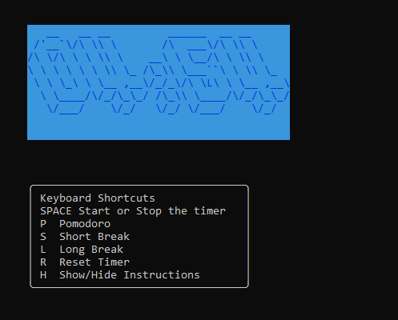

# tomayto-tomahto
tomayto-tomahto is a fully customizable pomodoro timer for the command line


inspired by the design of https://tomato-timer.com/
## Installation

```bash
git clone https://github.com/mauri-medina/tomayto-tomahto.git
pip install -r requirements.txt
```

## Usage

- To launch application
```python
python pomodoro.py
```

- To exit application press ctrl-c
- The keys to use the timer are explained in the application

## Customization

 - The font, colors, alarm sound and more can be customizable in the **`config.py`** file
 - The available font are listed in `http://www.figlet.org/fontdb.cgi`

## Contributing
Pull requests are welcome.

## License
[MIT](https://choosealicense.com/licenses/mit/)
